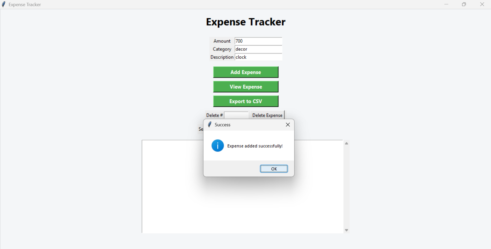
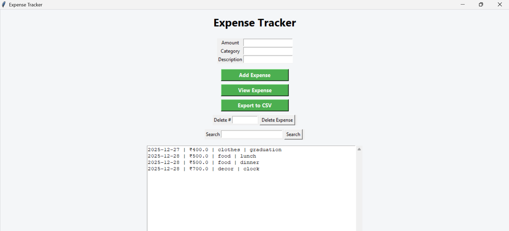
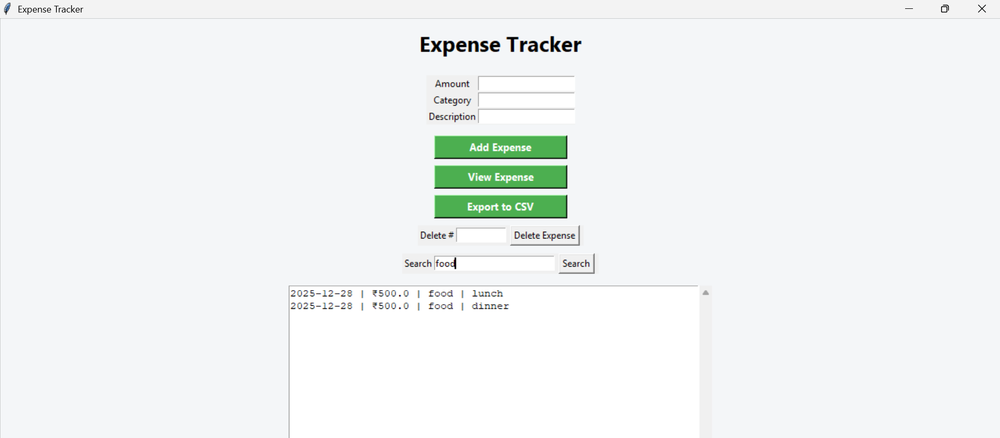
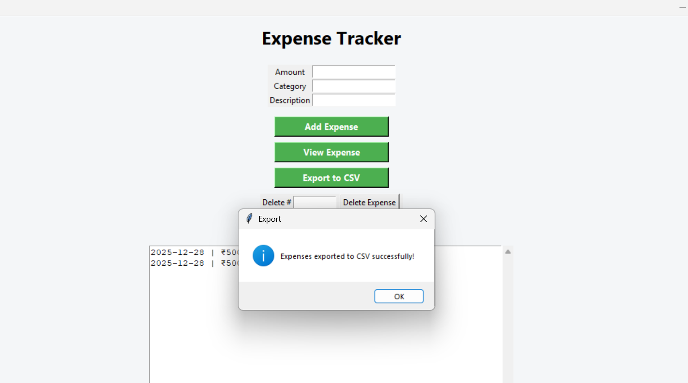

## 📸 Demo Screenshots

### Menu


### Adding an Expense


### Viewing Expenses


### CSV Export


---

## 🖥️ GUI Version (Tkinter)

This project also includes a **desktop GUI version built using Tkinter**, allowing users to manage expenses visually instead of using the command line.

### ✅ GUI Features
- Add expenses using input fields
- View all saved expenses
- Search expenses by category or description
- Delete expenses by index
- Export expenses to CSV
- Scrollable output display
- Clean and simple interface

---

## 📸 GUI Screenshots

### Main Window


### Add Expense


### View Expenses


### Search Expense


### Export to CSV


---

## ▶️ Run GUI Version

```bash
py gui.py
